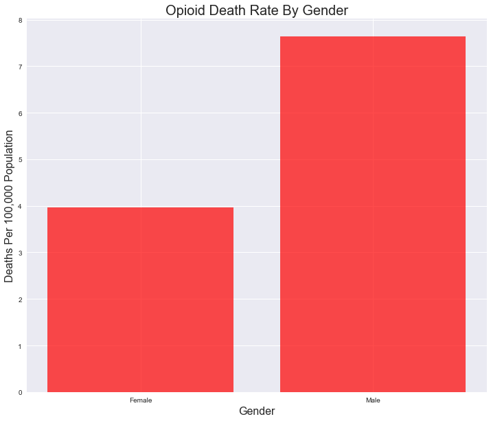
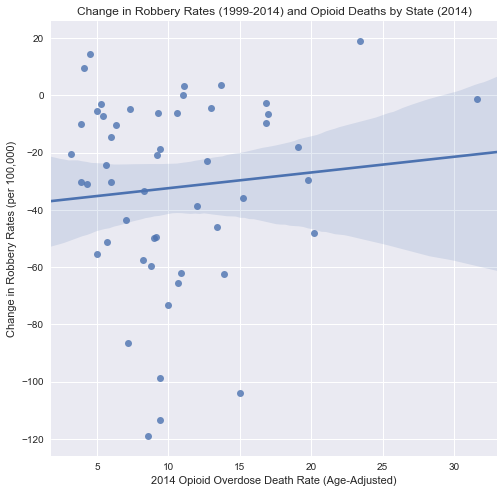

# Team One: The Opioid Crisis in the United States

### Analysis
* OBSERVED TREND For Research Question 1: According to the data, there is an opioid crisis in America. Opioid related deaths increased by more than an order of magnitude in 17 years. (1999: 2.0 deaths per 100,000 population; 2016: 12.6 deaths per 100,000 population.) By comparison, there was a negligable increase in anaesthesia deaths during the same period. Males are almost twice as likely to be affected as females. The age range of 25 - 54 years is most likely to be affected by the crisis. White people are twice as likely to be affected as black people; indigenous peoples are also heavily affected, while asian and pacific islanders are least affected by the crisis. The crisis is distributed fairly evenly throughout the continental United States, although there is a band in the geographic center of the country that is relatively unaffected. Both coasts of the country are heavily affected. Some notable hot-spots include West Virginia, the New England region, Oklahoma, parts of New Mexico, Utah, and Nevada, and the Pacific Northwest. Southern Alaska is affected, while Hawaii is only moderately affected.
* OBSERVED TREND For Research Question 2: CMS Medicare Part D Opioid Prescriber data reflects the change in opioid prescribing rates from 2013 to 2015 at the at the state level. At a high level, the majority of states see a decrease in opioid prescribing rates and an increase in extended-release rates over the three year period.  Wyoming is the only state to see an increase in opioid prescribing (0.23) and extended release prescribing (0.08). There are a few states that saw a decrease in both opioid prescribing and extended release prescribing: District of Columbia (-0.21 and -0.04), New Mexico (- 0.04 and -0.09), Oregon ( -0.30 and -0.15), and Washington ( -0.07 and -0.05)
* OBSERVED TREND For Research Question 3: Looking at 2010 census data of urban population percentage for each state and the KFF analysis of CDC opioid overdose deaths, there seems to be a significant increase in the change in opioid deaths the more rural a state is in that time period (p-value = 0.003). Opioid overdose deaths are used as a proxy for opioid usage in addition as a measure of the negative impact of opioid abuse.  
    It is a common assumption that crime and drugs are tightly correlated, as had been the case previously with heroin in the 1970s and crack in the 1980s. I test this association to see if it carries over to the current opioid epidemic. It seems that unlike the previous drug epidemics, the impact on crime seems to be negligible. Using the previous opioid death data and FBI uniform crime report data, changes from 1999-2014 in violent crime rates, robbery rates, and property crime rates each did not seem to have a significant impact on 2014 opioid death rates (p-values are 0.776, 0.513, 0.283 respectively).
* OBSERVED TREND For Research Question 4: Total CMS Spending increased from 398,350 to 1,254,525 million (214% increase). In this same time period National Health Expenditures also increased from 1,277,700 to 3,337,248 million (160% increase). Even though all National Health Expenditure costs increased, the percentage of those costs that were CMS increased from 31 to 37%.


###### Presentation Link: https://docs.google.com/presentation/d/e/2PACX-1vQqFIFLN2oR6E-hy-oEYjMyUquZUFxDQNi7EDebgkT-ytnWOijaL77kkB03nuBC1IDN-k-fZZ9sDYRP/pub?start=true&loop=false&delayms=60000 

##### Developer caveat for Question 6 data set 6 (map.) Geoplotlib does not have a direct analog for matplotlib.savefig. Screenshots (cntl-p in running map window) of the generated maps are available in the Output folder named Q1_Plot6a, b, and c.png. See requirements.txt for geoplotlib dependencies.

##### Developer caveat for warnings generated by statsmodel.api; Warnings are not important for this usage, as the only part deprecated is for timestamping generated output.

#### Dependencies


```python
import os                                                                    # os library
```


```python
import numpy as np                                                           # numpy library
```


```python
import pandas as pd                                                          # pandas library
```


```python
import matplotlib.pyplot as plt                                              # pyplot module from matplotlib library
```


```python
import geoplotlib                                                            # geoplotlib library
```


```python
from geoplotlib.utils import BoundingBox                                     # BoundingBox module from geoplotlib.utils
```


```python
from geoplotlib.colors import ColorMap                                       # ColorMap module from geoplotlib.colors
```


```python
import seaborn as sns                                                        # seaborn library
```


```python
import json                                                                  # json library
```


```python
import statsmodels.api as sm                                                 # to use regressions
```

    C:\Users\fcardwell\AppData\Local\Continuum\anaconda3\envs\PythonData\lib\site-packages\statsmodels\compat\pandas.py:56: FutureWarning: The pandas.core.datetools module is deprecated and will be removed in a future version. Please use the pandas.tseries module instead.
      from pandas.core import datetools
    


```python
sns.set()                                                                    # switches to seaborn default display
```

#### Research Question 1: Does the crisis exist? If so, what is it's magnitude? Who is affected? Where is it occuring?


```python
filename = 'Q1DS1.csv'                                                       # 1st data file for Q1
```


```python
csv_file = os.path.join(".", "Data Files", "Question_1", filename)           # creates path to read data
```


```python
q1ds1_df = pd.read_csv(csv_file, index_col="Year")                           # reads data from file
q1ds1_df.head()
```


<div>
<style>
    .dataframe thead tr:only-child th {
        text-align: right;
    }

    .dataframe thead th {
        text-align: left;
    }

    .dataframe tbody tr th {
        vertical-align: top;
    }
</style>
<table border="1" class="dataframe">
  <thead>
    <tr style="text-align: right;">
      <th></th>
      <th>Year Code</th>
      <th>Deaths</th>
      <th>Population</th>
      <th>Death Rate</th>
    </tr>
    <tr>
      <th>Year</th>
      <th></th>
      <th></th>
      <th></th>
      <th></th>
    </tr>
  </thead>
  <tbody>
    <tr>
      <th>1999</th>
      <td>1999</td>
      <td>5594</td>
      <td>279040168</td>
      <td>2.004729</td>
    </tr>
    <tr>
      <th>2000</th>
      <td>2000</td>
      <td>6011</td>
      <td>281421906</td>
      <td>2.135939</td>
    </tr>
    <tr>
      <th>2001</th>
      <td>2001</td>
      <td>7088</td>
      <td>284968955</td>
      <td>2.487288</td>
    </tr>
    <tr>
      <th>2002</th>
      <td>2002</td>
      <td>9318</td>
      <td>287625193</td>
      <td>3.239633</td>
    </tr>
    <tr>
      <th>2003</th>
      <td>2003</td>
      <td>10389</td>
      <td>290107933</td>
      <td>3.581081</td>
    </tr>
  </tbody>
</table>
</div>


```python
year_min = q1ds1_df.index.min()                                              # finds min and max dates
year_max = q1ds1_df.index.max()
```


```python
plt.figure(figsize = (17,10))                                                # sets bar chart parameters
plt.title('Opioid Deaths By Year: %s to %s' % (year_min, year_max), fontdict = {'fontsize': 20})
plt.xlabel('Year', fontdict = {'fontsize': 16})
plt.ylabel('Deaths Per 100,000 Population', fontdict = {'fontsize': 16})
xvals = np.arange(len(q1ds1_df))
tick_locations = [value+0.4 for value in xvals]
plt.bar(xvals, q1ds1_df['Death Rate'], color='r', alpha=0.7, align="edge")
plt.xticks(tick_locations, q1ds1_df['Year Code'], rotation="horizontal")
```


    ([<matplotlib.axis.XTick at 0xdc76048>,
      <matplotlib.axis.XTick at 0x3c2fa20>,
      <matplotlib.axis.XTick at 0xdc5ada0>,
      <matplotlib.axis.XTick at 0xdcf1ef0>,
      <matplotlib.axis.XTick at 0xdcfe630>,
      <matplotlib.axis.XTick at 0xdcfeda0>,
      <matplotlib.axis.XTick at 0xdd02550>,
      <matplotlib.axis.XTick at 0xdd02cc0>,
      <matplotlib.axis.XTick at 0xdd08470>,
      <matplotlib.axis.XTick at 0xdd08be0>,
      <matplotlib.axis.XTick at 0xdd0f390>,
      <matplotlib.axis.XTick at 0xdd0fb00>,
      <matplotlib.axis.XTick at 0xdd142b0>,
      <matplotlib.axis.XTick at 0xdd14a20>,
      <matplotlib.axis.XTick at 0xdd191d0>,
      <matplotlib.axis.XTick at 0xdd19940>,
      <matplotlib.axis.XTick at 0xdd1d0f0>,
      <matplotlib.axis.XTick at 0xdd1d860>],
     <a list of 18 Text xticklabel objects>)


```python
axes = plt.gca()
c1min, c1max = axes.get_ylim()                                               # gets y limits, sanity check
```


```python
plt.savefig('./Output/Q1_Plot1.png', bbox_inches = 'tight')                  # saves plot to file
plt.show()                                                                   # displays plot
```


#### Sanity Check - Look at Anaesthesia Deaths For Same Period


```python
filename = 'Q1DS2.csv'                                                       # 2nd data file for Q1
```


```python
csv_file = os.path.join(".", "Data Files", "Question_1", filename)           # creates path to read data
```


```python
q1ds2_df = pd.read_csv(csv_file, index_col="Year")                           # reads data from file
```


```python
year_min = q1ds2_df.index.min()                                              # finds min and max dates
year_max = q1ds2_df.index.max()
```


```python
plt.figure(figsize = (17,10))                                                # sets bar chart parameters
plt.title('Anaesthesia Deaths By Year: %s to %s' % (year_min, year_max), fontdict = {'fontsize': 20})
plt.xlabel('Year', fontdict = {'fontsize': 16})
plt.ylabel('Deaths Per 100,000 Population', fontdict = {'fontsize': 16})
xvals = np.arange(len(q1ds2_df))
tick_locations = [value+0.4 for value in xvals]
plt.bar(xvals, q1ds2_df['Death Rate'], color='b', alpha=0.7, align="edge")
plt.xticks(tick_locations, q1ds2_df['Year Code'], rotation="horizontal")
axes = plt.gca()
axes.set_ylim([c1min,c1max])                                                # set y limits to match first chart
```


    (0.0, 13.250775089523252)


```python
plt.savefig('./Output/Q1_Plot2.png', bbox_inches = 'tight')                  # saves plot to file
plt.show()                                                                   # displays plot
```


#### Who is affected?


```python
filename = 'Q1DS3.csv'                                                       # 3rd data file for Q1
csv_file = os.path.join(".", "Data Files", "Question_1", filename)           # creates path to read data
q1ds3_df = pd.read_csv(csv_file)                                             # reads data from file
plt.figure(figsize = (12,10))                                                # sets bar chart parameters
plt.title('Opioid Death Rate By Gender', fontdict = {'fontsize': 20})
plt.xlabel('Gender', fontdict = {'fontsize': 16})
plt.ylabel('Deaths Per 100,000 Population', fontdict = {'fontsize': 16})
xvals = np.arange(len(q1ds3_df))
tick_locations = [value+0.4 for value in xvals]
plt.bar(xvals, q1ds3_df['Death Rate'], color='r', alpha=0.7, align="edge")
plt.xticks(tick_locations, q1ds3_df['Gender'], rotation="horizontal")
```


    ([<matplotlib.axis.XTick at 0xdf09278>, <matplotlib.axis.XTick at 0xdeafc88>],
     <a list of 2 Text xticklabel objects>)


```python
plt.savefig('./Output/Q1_Plot3.png', bbox_inches = 'tight')                  # saves plot to file
plt.show()                                                                   # displays plot
```





```python
filename = 'Q1DS4.csv'                                                       # 4th data file for Q1
csv_file = os.path.join(".", "Data Files", "Question_1", filename)           # creates path to read data
q1ds4_df = pd.read_csv(csv_file)                                             # reads data from file
plt.figure(figsize = (12,10))                                                # sets bar chart parameters
plt.title('Opioid Death Rate By Age Group', fontdict = {'fontsize': 20})
plt.xlabel('Ten-Year Age Groups', fontdict = {'fontsize': 16})
plt.ylabel('Deaths Per 100,000 Population', fontdict = {'fontsize': 16})
xvals = np.arange(len(q1ds4_df))
tick_locations = [value+0.4 for value in xvals]
plt.bar(xvals, q1ds4_df['Death Rate'], color='r', alpha=0.7, align="edge")
plt.xticks(tick_locations, q1ds4_df['Ten-Year Age Groups'], rotation="horizontal")
```


    ([<matplotlib.axis.XTick at 0xe882c50>,
      <matplotlib.axis.XTick at 0xe882160>,
      <matplotlib.axis.XTick at 0xe88d668>,
      <matplotlib.axis.XTick at 0xe477f98>,
      <matplotlib.axis.XTick at 0xe4806d8>,
      <matplotlib.axis.XTick at 0xe480e48>,
      <matplotlib.axis.XTick at 0xe4855f8>,
      <matplotlib.axis.XTick at 0xe485d68>,
      <matplotlib.axis.XTick at 0xe489518>,
      <matplotlib.axis.XTick at 0xe489c88>,
      <matplotlib.axis.XTick at 0xe48f438>],
     <a list of 11 Text xticklabel objects>)


```python
plt.savefig('./Output/Q1_Plot4.png', bbox_inches = 'tight')                  # saves plot to file
plt.show()                                                                   # displays plot
```


```python
filename = 'Q1DS5.csv'                                                       # 5th data file for Q1
csv_file = os.path.join(".", "Data Files", "Question_1", filename)           # creates path to read data
q1ds5_df = pd.read_csv(csv_file)                                             # 5th data file for Q1
plt.figure(figsize = (12,10))                                                # sets bar chart parameters
plt.title('Opioid Death Rate By Race', fontdict = {'fontsize': 20})
plt.xlabel('Race', fontdict = {'fontsize': 16})
plt.ylabel('Deaths Per 100,000 Population', fontdict = {'fontsize': 16})
xvals = np.arange(len(q1ds5_df))
tick_locations = [value+0.4 for value in xvals]
plt.bar(xvals, q1ds5_df['Death Rate'], color='r', alpha=0.7, align="edge")
plt.xticks(tick_locations, q1ds5_df['Race'], rotation="horizontal")
```


    ([<matplotlib.axis.XTick at 0xe669eb8>,
      <matplotlib.axis.XTick at 0xe662f98>,
      <matplotlib.axis.XTick at 0xe666ef0>,
      <matplotlib.axis.XTick at 0xe697f28>],
     <a list of 4 Text xticklabel objects>)


```python
plt.savefig('./Output/Q1_Plot5.png', bbox_inches = 'tight')                  # saves plot to file
plt.show()                                                                   # displays plot
```


#### Where is it occuring?


```python
filename = 'Q1DS6.json'                                                      # deaths data file for Q1
json_file_1 = os.path.join(".", "Data Files", "Question_1", filename)        # creates path to read data
filename = 'gz_2010_us_050_00_20m.json'                                      # map shape data file for Q1
json_file_2 = os.path.join(".", "Data Files", "Question_1", filename)        # creates path to read data
```


```python
# function finds the death rate for the selected county, and converts it to color
def get_color(properties):
    key = str(int(properties['STATE'])) + properties['COUNTY']
    if key in Q1DS6:
        return cmap.to_color(Q1DS6.get(key), 5, 'lin')
    else:
        return [0, 0, 0, 0]
```


```python
with open(json_file_1) as fin:                                              # opens json file
    Q1DS6 = json.load(fin)
```


```python
cmap = ColorMap('Reds', alpha=255, levels=5)                               # displays map plot
geoplotlib.geojson(json_file_2, fill=True, color=get_color, f_tooltip=lambda properties: properties['NAME'])
geoplotlib.geojson(json_file_2, fill=False, color=[255, 255, 255, 64])
geoplotlib.set_bbox(BoundingBox.USA)
geoplotlib.show()
```

#### Research Question 2
#### Opioid Prescriber Rates

Change in Medicare Part D Opioid Prescribing Rates from 2013 to 2015 by State


```python
# Took CMS Medicare Part D Opioid Prescribing Geographic 2013 2015 Excel file and created CSV files for the three taps 1) state 2) county and 3) zip
# Stored presciber-state file in a variable
prescriber_state = "Data Files/prescriber_state.csv"
prescriber_state_df = pd.read_csv(prescriber_state)
prescriber_state_df.head()
```


<div>
<style>
    .dataframe thead tr:only-child th {
        text-align: right;
    }

    .dataframe thead th {
        text-align: left;
    }

    .dataframe tbody tr th {
        vertical-align: top;
    }
</style>
<table border="1" class="dataframe">
  <thead>
    <tr style="text-align: right;">
      <th></th>
      <th>State_Name</th>
      <th>State_Abbreviation</th>
      <th>State_FIPS</th>
      <th>2013_Part_ D_Prescribers</th>
      <th>2013_Part_Opioid_Prescribers</th>
      <th>2013_Opioid Claims</th>
      <th>2013_Extended_Release_Opioid_Claims</th>
      <th>2013_Overall_Claims</th>
      <th>2013_Opioid_Prescribing_Rate</th>
      <th>2013_Extended_Release_Opioid_Prescribing_Rate</th>
      <th>...</th>
      <th>2014_Extended_Release_Opioid_Prescribing_Rate</th>
      <th>2015_Part D Prescribers</th>
      <th>2015_Part D Opioid Prescribers</th>
      <th>2015_Opioid Claims</th>
      <th>2015_Extended Release Opioid Claims</th>
      <th>2015_Overall_Claims</th>
      <th>2015_Opioid_Prescribing_Rate</th>
      <th>2015_Extended_Release_Opioid_Prescribing_ Rate</th>
      <th>2013_2015_Change_in_Opioid_Prescribing_Rate</th>
      <th>2013_2015_Change_in_Extended_Release_Opioid_Prescribing_Rate</th>
    </tr>
  </thead>
  <tbody>
    <tr>
      <th>0</th>
      <td>National</td>
      <td>NaN</td>
      <td>NaN</td>
      <td>1,037,770</td>
      <td>491,500</td>
      <td>78,045,683</td>
      <td>4,773,286</td>
      <td>1,342,096,654</td>
      <td>5.82</td>
      <td>6.12</td>
      <td>...</td>
      <td>6.27</td>
      <td>1,090,979</td>
      <td>496,383</td>
      <td>78,372,855</td>
      <td>5,257,481</td>
      <td>1,418,618,875</td>
      <td>5.52</td>
      <td>6.71</td>
      <td>-0.30</td>
      <td>0.59</td>
    </tr>
    <tr>
      <th>1</th>
      <td>Alabama</td>
      <td>AL</td>
      <td>1.0</td>
      <td>12,820</td>
      <td>7,422</td>
      <td>2,260,284</td>
      <td>118,523</td>
      <td>29,160,952</td>
      <td>7.75</td>
      <td>5.24</td>
      <td>...</td>
      <td>5.24</td>
      <td>13,492</td>
      <td>6,980</td>
      <td>2,179,506</td>
      <td>121,061</td>
      <td>28,898,258</td>
      <td>7.54</td>
      <td>5.55</td>
      <td>-0.21</td>
      <td>0.31</td>
    </tr>
    <tr>
      <th>2</th>
      <td>Alaska</td>
      <td>AK</td>
      <td>2.0</td>
      <td>2,275</td>
      <td>1,099</td>
      <td>86,517</td>
      <td>8,602</td>
      <td>1,281,057</td>
      <td>6.75</td>
      <td>9.94</td>
      <td>...</td>
      <td>10.44</td>
      <td>2,342</td>
      <td>1,067</td>
      <td>89,275</td>
      <td>9,509</td>
      <td>1,339,671</td>
      <td>6.66</td>
      <td>10.65</td>
      <td>-0.09</td>
      <td>0.71</td>
    </tr>
    <tr>
      <th>3</th>
      <td>Arizona</td>
      <td>AZ</td>
      <td>4.0</td>
      <td>20,542</td>
      <td>10,510</td>
      <td>1,545,138</td>
      <td>151,086</td>
      <td>22,126,421</td>
      <td>6.98</td>
      <td>9.78</td>
      <td>...</td>
      <td>9.78</td>
      <td>21,833</td>
      <td>10,992</td>
      <td>1,649,600</td>
      <td>169,215</td>
      <td>24,315,477</td>
      <td>6.78</td>
      <td>10.26</td>
      <td>-0.20</td>
      <td>0.48</td>
    </tr>
    <tr>
      <th>4</th>
      <td>Arkansas</td>
      <td>AR</td>
      <td>5.0</td>
      <td>7,909</td>
      <td>4,700</td>
      <td>1,128,356</td>
      <td>57,519</td>
      <td>16,759,116</td>
      <td>6.73</td>
      <td>5.10</td>
      <td>...</td>
      <td>5.17</td>
      <td>8,327</td>
      <td>4,714</td>
      <td>1,132,475</td>
      <td>63,261</td>
      <td>17,786,636</td>
      <td>6.37</td>
      <td>5.59</td>
      <td>-0.36</td>
      <td>0.49</td>
    </tr>
  </tbody>
</table>
<p>5 rows × 26 columns</p>
</div>


```python
#Selected the opioid prescribe rate columsn for years 2013-2015
prescriber_state_rate_df = prescriber_state_df[["State_Name","State_Abbreviation","2013_Opioid_Prescribing_Rate","2013_Extended_Release_Opioid_Prescribing_Rate","2014_Opioid_Prescribing_Rate","2014_Extended_Release_Opioid_Prescribing_Rate","2015_Opioid_Prescribing_Rate","2015_Extended_Release_Opioid_Prescribing_ Rate","2013_2015_Change_in_Opioid_Prescribing_Rate","2013_2015_Change_in_Extended_Release_Opioid_Prescribing_Rate "]]
prescriber_state_df.fillna("National")
prescriber_state_df.head()
```


<div>
<style>
    .dataframe thead tr:only-child th {
        text-align: right;
    }

    .dataframe thead th {
        text-align: left;
    }

    .dataframe tbody tr th {
        vertical-align: top;
    }
</style>
<table border="1" class="dataframe">
  <thead>
    <tr style="text-align: right;">
      <th></th>
      <th>State_Name</th>
      <th>State_Abbreviation</th>
      <th>State_FIPS</th>
      <th>2013_Part_ D_Prescribers</th>
      <th>2013_Part_Opioid_Prescribers</th>
      <th>2013_Opioid Claims</th>
      <th>2013_Extended_Release_Opioid_Claims</th>
      <th>2013_Overall_Claims</th>
      <th>2013_Opioid_Prescribing_Rate</th>
      <th>2013_Extended_Release_Opioid_Prescribing_Rate</th>
      <th>...</th>
      <th>2014_Extended_Release_Opioid_Prescribing_Rate</th>
      <th>2015_Part D Prescribers</th>
      <th>2015_Part D Opioid Prescribers</th>
      <th>2015_Opioid Claims</th>
      <th>2015_Extended Release Opioid Claims</th>
      <th>2015_Overall_Claims</th>
      <th>2015_Opioid_Prescribing_Rate</th>
      <th>2015_Extended_Release_Opioid_Prescribing_ Rate</th>
      <th>2013_2015_Change_in_Opioid_Prescribing_Rate</th>
      <th>2013_2015_Change_in_Extended_Release_Opioid_Prescribing_Rate</th>
    </tr>
  </thead>
  <tbody>
    <tr>
      <th>0</th>
      <td>National</td>
      <td>NaN</td>
      <td>NaN</td>
      <td>1,037,770</td>
      <td>491,500</td>
      <td>78,045,683</td>
      <td>4,773,286</td>
      <td>1,342,096,654</td>
      <td>5.82</td>
      <td>6.12</td>
      <td>...</td>
      <td>6.27</td>
      <td>1,090,979</td>
      <td>496,383</td>
      <td>78,372,855</td>
      <td>5,257,481</td>
      <td>1,418,618,875</td>
      <td>5.52</td>
      <td>6.71</td>
      <td>-0.30</td>
      <td>0.59</td>
    </tr>
    <tr>
      <th>1</th>
      <td>Alabama</td>
      <td>AL</td>
      <td>1.0</td>
      <td>12,820</td>
      <td>7,422</td>
      <td>2,260,284</td>
      <td>118,523</td>
      <td>29,160,952</td>
      <td>7.75</td>
      <td>5.24</td>
      <td>...</td>
      <td>5.24</td>
      <td>13,492</td>
      <td>6,980</td>
      <td>2,179,506</td>
      <td>121,061</td>
      <td>28,898,258</td>
      <td>7.54</td>
      <td>5.55</td>
      <td>-0.21</td>
      <td>0.31</td>
    </tr>
    <tr>
      <th>2</th>
      <td>Alaska</td>
      <td>AK</td>
      <td>2.0</td>
      <td>2,275</td>
      <td>1,099</td>
      <td>86,517</td>
      <td>8,602</td>
      <td>1,281,057</td>
      <td>6.75</td>
      <td>9.94</td>
      <td>...</td>
      <td>10.44</td>
      <td>2,342</td>
      <td>1,067</td>
      <td>89,275</td>
      <td>9,509</td>
      <td>1,339,671</td>
      <td>6.66</td>
      <td>10.65</td>
      <td>-0.09</td>
      <td>0.71</td>
    </tr>
    <tr>
      <th>3</th>
      <td>Arizona</td>
      <td>AZ</td>
      <td>4.0</td>
      <td>20,542</td>
      <td>10,510</td>
      <td>1,545,138</td>
      <td>151,086</td>
      <td>22,126,421</td>
      <td>6.98</td>
      <td>9.78</td>
      <td>...</td>
      <td>9.78</td>
      <td>21,833</td>
      <td>10,992</td>
      <td>1,649,600</td>
      <td>169,215</td>
      <td>24,315,477</td>
      <td>6.78</td>
      <td>10.26</td>
      <td>-0.20</td>
      <td>0.48</td>
    </tr>
    <tr>
      <th>4</th>
      <td>Arkansas</td>
      <td>AR</td>
      <td>5.0</td>
      <td>7,909</td>
      <td>4,700</td>
      <td>1,128,356</td>
      <td>57,519</td>
      <td>16,759,116</td>
      <td>6.73</td>
      <td>5.10</td>
      <td>...</td>
      <td>5.17</td>
      <td>8,327</td>
      <td>4,714</td>
      <td>1,132,475</td>
      <td>63,261</td>
      <td>17,786,636</td>
      <td>6.37</td>
      <td>5.59</td>
      <td>-0.36</td>
      <td>0.49</td>
    </tr>
  </tbody>
</table>
<p>5 rows × 26 columns</p>
</div>


```python
#Selected the opioid prescribe rate columsn for years 2013-2015

prescriber_state_rate_changeex_df = prescriber_state_df[["State_Name","2013_2015_Change_in_Opioid_Prescribing_Rate", "2013_2015_Change_in_Extended_Release_Opioid_Prescribing_Rate "]]
prescriber_state_rate_changeex_df.columns = ['State', 'Opioid', 'Extended Release']
prescriber_state_rate_changeex_df.set_index("State", inplace = True)
prescriber_state_rate_changeex_df.head()

prescriber_state_rate_change_za =prescriber_state_rate_changeex_df.sort_index(ascending=False)
prescriber_state_rate_change_za.head()
```


<div>
<style>
    .dataframe thead tr:only-child th {
        text-align: right;
    }

    .dataframe thead th {
        text-align: left;
    }

    .dataframe tbody tr th {
        vertical-align: top;
    }
</style>
<table border="1" class="dataframe">
  <thead>
    <tr style="text-align: right;">
      <th></th>
      <th>Opioid</th>
      <th>Extended Release</th>
    </tr>
    <tr>
      <th>State</th>
      <th></th>
      <th></th>
    </tr>
  </thead>
  <tbody>
    <tr>
      <th>Wyoming</th>
      <td>0.23</td>
      <td>0.08</td>
    </tr>
    <tr>
      <th>Wisconsin</th>
      <td>-0.10</td>
      <td>0.30</td>
    </tr>
    <tr>
      <th>West Virginia</th>
      <td>-0.73</td>
      <td>0.33</td>
    </tr>
    <tr>
      <th>Washington</th>
      <td>-0.07</td>
      <td>-0.05</td>
    </tr>
    <tr>
      <th>Virginia</th>
      <td>-0.41</td>
      <td>0.45</td>
    </tr>
  </tbody>
</table>
</div>


```python
# Setting the positions and width for the bars
pos = list(range(len(prescriber_state_rate_df["State_Name"]))) 
width = 0.25 


# Plotting the bars
fig, ax = plt.subplots(figsize=(12,10))

# Create a bar with pre_score data,
# in position pos,
plt.bar(pos, 
        #using df['pre_score'] data,
         
        prescriber_state_rate_changeex_df["Opioid"],
        # of width
        width, 
        # with alpha 0.5
        alpha=0.5, 
        # with color
        color='r', 
        # with label the first value in first_name
        label=prescriber_state_rate_changeex_df["Opioid"][0]) 

# Create a bar with mid_score data,
# in position pos + some width buffer,
plt.bar([p + width for p in pos], 
        #using df['mid_score'] data,
        prescriber_state_rate_changeex_df["Extended Release"],
        # of width
        width, 
        # with alpha 0.5
        alpha=0.5, 
        # with color
        color='b', 
        # with label the second value in first_name
        label= prescriber_state_rate_changeex_df["Extended Release"][1]) 

# Set the y axis label
ax.set_ylabel('Opioid Prescriber Rate')
#plt.ylabel("Prescribing Rate")

# Set the chart's title
ax.set_title("Change in Opioid Prescriber Rate 2013-2015", loc='center')
#plt.title("CMS Medicare Part D Opioid Prescribing Rates 2013-2015 by Sate")

# Set the position of the x ticks
ax.set_xticks([p + 1.5 * width for p in pos])

# Set the labels for the x ticks
ax.set_xticklabels(prescriber_state_rate_df["State_Name"], rotation = "vertical")
#plt.xlabel("State")


# Setting the x-axis and y-axis limits
plt.xlim(min(pos)-width, max(pos)+width*4)
plt.ylim([-0.8, max( prescriber_state_rate_changeex_df["Opioid"] + prescriber_state_rate_changeex_df["Extended Release"])] )

# Adding the legend and showing the plot
plt.legend(['Opioid Prescribing Rate', 'Extended Release Rate'], loc='upper right')
plt.grid()
plt.show() # displays plot
```


```python
# Plot the lollipop plot
plt.figure(figsize=(16,10))
my_range=range(1,len(prescriber_state_rate_change_za.index)+1)
plt.hlines(y=my_range, xmin=prescriber_state_rate_change_za["Opioid"], xmax=prescriber_state_rate_change_za["Extended Release"], color='grey', alpha=0.4)
plt.scatter(prescriber_state_rate_change_za["Opioid"], my_range, color='skyblue', alpha=1, label='Opioid')
plt.scatter(prescriber_state_rate_change_za["Extended Release"], my_range, color='green', alpha=0.4 , label='Extended Release')
plt.legend()


# Add title and axis names
plt.yticks(my_range, prescriber_state_rate_change_za.index)
plt.title("Change in Opioid Prescriber Rate 2013-2015", loc='center')
plt.xlabel('Prescriber Rate')
plt.ylabel('State')

plt.show() # displays plot
```


#### Research Question 3
####  - Impact of the opioid epidemic
Are urban areas impacted more by the opioid epidemic? Scatterplot of Urban vs. not urban 


```python
#importing csv files

csv_file = r'Data Files/Question_3/ChangeOpiodDeaths(00-10).csv'

OpDeathsDelta_df = pd.read_csv(csv_file)

```


```python
# scatterplot: Urban population % by state in year 2010 on change in opioid death rates from years 2000-2010 

sns.lmplot(x='2010', y='Change in Death', data = OpDeathsDelta_df, size = 8)

# set titles and labels
plt.title('Opioid Deaths and Urbanization (2000 - 2010)')
plt.xlabel('Urban population % by state in the Year 2010')
plt.ylabel('Change in Opioid Overdose Death Rate per 100,000')
plt.show()
```


```python
# regression of Opioid Deaths on Urbanization (2000 - 2010)

y = OpDeathsDelta_df['Change in Death']
x = OpDeathsDelta_df['2010']
x = sm.add_constant(x)
results = sm.OLS(y, x).fit()

results.summary()
```


<table class="simpletable">
<caption>OLS Regression Results</caption>
<tr>
  <th>Dep. Variable:</th>     <td>Change in Death</td> <th>  R-squared:         </th> <td>   0.189</td>
</tr>
<tr>
  <th>Model:</th>                   <td>OLS</td>       <th>  Adj. R-squared:    </th> <td>   0.170</td>
</tr>
<tr>
  <th>Method:</th>             <td>Least Squares</td>  <th>  F-statistic:       </th> <td>   9.814</td>
</tr>
<tr>
  <th>Date:</th>             <td>Mon, 08 Jan 2018</td> <th>  Prob (F-statistic):</th>  <td>0.00315</td>
</tr>
<tr>
  <th>Time:</th>                 <td>23:05:27</td>     <th>  Log-Likelihood:    </th> <td> -117.55</td>
</tr>
<tr>
  <th>No. Observations:</th>      <td>    44</td>      <th>  AIC:               </th> <td>   239.1</td>
</tr>
<tr>
  <th>Df Residuals:</th>          <td>    42</td>      <th>  BIC:               </th> <td>   242.7</td>
</tr>
<tr>
  <th>Df Model:</th>              <td>     1</td>      <th>                     </th>     <td> </td>   
</tr>
<tr>
  <th>Covariance Type:</th>      <td>nonrobust</td>    <th>                     </th>     <td> </td>   
</tr>
</table>
<table class="simpletable">
<tr>
    <td></td>       <th>coef</th>     <th>std err</th>      <th>t</th>      <th>P>|t|</th>  <th>[0.025</th>    <th>0.975]</th>  
</tr>
<tr>
  <th>const</th> <td>   13.4391</td> <td>    2.893</td> <td>    4.645</td> <td> 0.000</td> <td>    7.600</td> <td>   19.278</td>
</tr>
<tr>
  <th>2010</th>  <td>   -0.1168</td> <td>    0.037</td> <td>   -3.133</td> <td> 0.003</td> <td>   -0.192</td> <td>   -0.042</td>
</tr>
</table>
<table class="simpletable">
<tr>
  <th>Omnibus:</th>       <td>30.212</td> <th>  Durbin-Watson:     </th> <td>   2.013</td>
</tr>
<tr>
  <th>Prob(Omnibus):</th> <td> 0.000</td> <th>  Jarque-Bera (JB):  </th> <td>  79.175</td>
</tr>
<tr>
  <th>Skew:</th>          <td> 1.735</td> <th>  Prob(JB):          </th> <td>6.42e-18</td>
</tr>
<tr>
  <th>Kurtosis:</th>      <td> 8.580</td> <th>  Cond. No.          </th> <td>    416.</td>
</tr>
</table>


#### - Crime and opioids


```python
#importing csv file of overall crime

csv_file = r'Data Files/Question_3/crime_df.csv'

crime_df = pd.read_csv(csv_file)

#importing Opioid deaths df 

csv_file1 = r'Data Files/Question_3/OpiodDeathsUrbanPop.csv'

OpDeaths_Urb_df = pd.read_csv(csv_file1)

```


```python
# Scatterplot of change in violent crime and opioid deaths in 2014
plt.figure(figsize=(8,8))
# scatter with regression line. 
sns.regplot(x=OpDeaths_Urb_df['2014__Opioid Overdose Death Rate (Age-Adjusted)'],\
           y=crime_df['Violent Crime rate_change'])
            #For some reason sns.lmplot doesn't work with data from two df's but sns.regplot does.

# set title and labels
plt.title('Change in Violent Crime Rates (1999-2014) and Opioid Deaths by State (2014)')
plt.xlabel('2014 Opioid Overdose Death Rate (Age-Adjusted)')
plt.ylabel('Change in Violent Crime Rates (per 100,000)')
plt.show()


```


```python
# regression of Change in Violent Crime Rates (1999-2014) and Opioid Deaths by State (2014)

y = crime_df['Violent Crime rate_change']
x = OpDeaths_Urb_df['2014__Opioid Overdose Death Rate (Age-Adjusted)']
x = sm.add_constant(x)
results = sm.OLS(y, x).fit()

results.summary()
```


<table class="simpletable">
<caption>OLS Regression Results</caption>
<tr>
  <th>Dep. Variable:</th>    <td>Violent Crime rate_change</td> <th>  R-squared:         </th> <td>   0.002</td>
</tr>
<tr>
  <th>Model:</th>                       <td>OLS</td>            <th>  Adj. R-squared:    </th> <td>  -0.019</td>
</tr>
<tr>
  <th>Method:</th>                 <td>Least Squares</td>       <th>  F-statistic:       </th> <td> 0.08176</td>
</tr>
<tr>
  <th>Date:</th>                 <td>Mon, 08 Jan 2018</td>      <th>  Prob (F-statistic):</th>  <td> 0.776</td> 
</tr>
<tr>
  <th>Time:</th>                     <td>23:05:32</td>          <th>  Log-Likelihood:    </th> <td> -318.43</td>
</tr>
<tr>
  <th>No. Observations:</th>          <td>    51</td>           <th>  AIC:               </th> <td>   640.9</td>
</tr>
<tr>
  <th>Df Residuals:</th>              <td>    49</td>           <th>  BIC:               </th> <td>   644.7</td>
</tr>
<tr>
  <th>Df Model:</th>                  <td>     1</td>           <th>                     </th>     <td> </td>   
</tr>
<tr>
  <th>Covariance Type:</th>          <td>nonrobust</td>         <th>                     </th>     <td> </td>   
</tr>
</table>
<table class="simpletable">
<tr>
                         <td></td>                            <th>coef</th>     <th>std err</th>      <th>t</th>      <th>P>|t|</th>  <th>[0.025</th>    <th>0.975]</th>  
</tr>
<tr>
  <th>const</th>                                           <td>  -84.5308</td> <td>   37.541</td> <td>   -2.252</td> <td> 0.029</td> <td> -159.971</td> <td>   -9.090</td>
</tr>
<tr>
  <th>2014__Opioid Overdose Death Rate (Age-Adjusted)</th> <td>   -0.9056</td> <td>    3.167</td> <td>   -0.286</td> <td> 0.776</td> <td>   -7.270</td> <td>    5.459</td>
</tr>
</table>
<table class="simpletable">
<tr>
  <th>Omnibus:</th>       <td> 0.363</td> <th>  Durbin-Watson:     </th> <td>   1.962</td>
</tr>
<tr>
  <th>Prob(Omnibus):</th> <td> 0.834</td> <th>  Jarque-Bera (JB):  </th> <td>   0.291</td>
</tr>
<tr>
  <th>Skew:</th>          <td>-0.175</td> <th>  Prob(JB):          </th> <td>   0.865</td>
</tr>
<tr>
  <th>Kurtosis:</th>      <td> 2.880</td> <th>  Cond. No.          </th> <td>    25.1</td>
</tr>
</table>


```python
# Scatterplot of change in robbery rates and opioid deaths in 2014
plt.figure(figsize=(8,8))
sns.regplot(x=OpDeaths_Urb_df['2014__Opioid Overdose Death Rate (Age-Adjusted)'],\
           y=crime_df['Robbery rate_change'])

# set title and labels
plt.title('Change in Robbery Rates (1999-2014) and Opioid Deaths by State (2014)')
plt.xlabel('2014 Opioid Overdose Death Rate (Age-Adjusted)')
plt.ylabel('Change in Robbery Rates (per 100,000)')
plt.show()
```





```python
# regression of Change in Robbery Rates (1999-2014) and Opioid Deaths by State (2014)
y = crime_df['Robbery rate_change']
x = OpDeaths_Urb_df['2014__Opioid Overdose Death Rate (Age-Adjusted)']
x = sm.add_constant(x)
results = sm.OLS(y, x).fit()

results.summary()
```


<table class="simpletable">
<caption>OLS Regression Results</caption>
<tr>
  <th>Dep. Variable:</th>    <td>Robbery rate_change</td> <th>  R-squared:         </th> <td>   0.009</td>
</tr>
<tr>
  <th>Model:</th>                    <td>OLS</td>         <th>  Adj. R-squared:    </th> <td>  -0.011</td>
</tr>
<tr>
  <th>Method:</th>              <td>Least Squares</td>    <th>  F-statistic:       </th> <td>  0.4351</td>
</tr>
<tr>
  <th>Date:</th>              <td>Mon, 08 Jan 2018</td>   <th>  Prob (F-statistic):</th>  <td> 0.513</td> 
</tr>
<tr>
  <th>Time:</th>                  <td>23:05:34</td>       <th>  Log-Likelihood:    </th> <td> -250.27</td>
</tr>
<tr>
  <th>No. Observations:</th>       <td>    51</td>        <th>  AIC:               </th> <td>   504.5</td>
</tr>
<tr>
  <th>Df Residuals:</th>           <td>    49</td>        <th>  BIC:               </th> <td>   508.4</td>
</tr>
<tr>
  <th>Df Model:</th>               <td>     1</td>        <th>                     </th>     <td> </td>   
</tr>
<tr>
  <th>Covariance Type:</th>       <td>nonrobust</td>      <th>                     </th>     <td> </td>   
</tr>
</table>
<table class="simpletable">
<tr>
                         <td></td>                            <th>coef</th>     <th>std err</th>      <th>t</th>      <th>P>|t|</th>  <th>[0.025</th>    <th>0.975]</th>  
</tr>
<tr>
  <th>const</th>                                           <td>  -37.9212</td> <td>    9.864</td> <td>   -3.845</td> <td> 0.000</td> <td>  -57.743</td> <td>  -18.099</td>
</tr>
<tr>
  <th>2014__Opioid Overdose Death Rate (Age-Adjusted)</th> <td>    0.5489</td> <td>    0.832</td> <td>    0.660</td> <td> 0.513</td> <td>   -1.123</td> <td>    2.221</td>
</tr>
</table>
<table class="simpletable">
<tr>
  <th>Omnibus:</th>       <td> 7.046</td> <th>  Durbin-Watson:     </th> <td>   1.952</td>
</tr>
<tr>
  <th>Prob(Omnibus):</th> <td> 0.030</td> <th>  Jarque-Bera (JB):  </th> <td>   6.576</td>
</tr>
<tr>
  <th>Skew:</th>          <td>-0.875</td> <th>  Prob(JB):          </th> <td>  0.0373</td>
</tr>
<tr>
  <th>Kurtosis:</th>      <td> 3.178</td> <th>  Cond. No.          </th> <td>    25.1</td>
</tr>
</table>


```python
# Scatterplot of change in property crime rates and opioid deaths in 2014
plt.figure(figsize=(8,8))
sns.regplot(x=OpDeaths_Urb_df['2014__Opioid Overdose Death Rate (Age-Adjusted)'],\
           y=crime_df['Property crime rate_change'])

# set title and labels
plt.title('Change in Property Crime Rates (1999-2014) and Opioid Deaths by State (2014)')
plt.xlabel('2014 Opioid Overdose Death Rate (Age-Adjusted)')
plt.ylabel('Change in Property Crime Rates (per 100,000)')
plt.show()
```


```python
# regression of Change in property crime rates and Opioid Deaths by State (2014)
y = crime_df['Property crime rate_change']
x = OpDeaths_Urb_df['2014__Opioid Overdose Death Rate (Age-Adjusted)']
x = sm.add_constant(x)
results = sm.OLS(y, x).fit()

results.summary()
```


<table class="simpletable">
<caption>OLS Regression Results</caption>
<tr>
  <th>Dep. Variable:</th>    <td>Property crime rate_change</td> <th>  R-squared:         </th> <td>   0.024</td>
</tr>
<tr>
  <th>Model:</th>                        <td>OLS</td>            <th>  Adj. R-squared:    </th> <td>   0.004</td>
</tr>
<tr>
  <th>Method:</th>                  <td>Least Squares</td>       <th>  F-statistic:       </th> <td>   1.180</td>
</tr>
<tr>
  <th>Date:</th>                  <td>Mon, 08 Jan 2018</td>      <th>  Prob (F-statistic):</th>  <td> 0.283</td> 
</tr>
<tr>
  <th>Time:</th>                      <td>23:05:35</td>          <th>  Log-Likelihood:    </th> <td> -382.17</td>
</tr>
<tr>
  <th>No. Observations:</th>           <td>    51</td>           <th>  AIC:               </th> <td>   768.3</td>
</tr>
<tr>
  <th>Df Residuals:</th>               <td>    49</td>           <th>  BIC:               </th> <td>   772.2</td>
</tr>
<tr>
  <th>Df Model:</th>                   <td>     1</td>           <th>                     </th>     <td> </td>   
</tr>
<tr>
  <th>Covariance Type:</th>           <td>nonrobust</td>         <th>                     </th>     <td> </td>   
</tr>
</table>
<table class="simpletable">
<tr>
                         <td></td>                            <th>coef</th>     <th>std err</th>      <th>t</th>      <th>P>|t|</th>  <th>[0.025</th>    <th>0.975]</th>  
</tr>
<tr>
  <th>const</th>                                           <td>-1248.6099</td> <td>  130.989</td> <td>   -9.532</td> <td> 0.000</td> <td>-1511.842</td> <td> -985.377</td>
</tr>
<tr>
  <th>2014__Opioid Overdose Death Rate (Age-Adjusted)</th> <td>   12.0066</td> <td>   11.051</td> <td>    1.087</td> <td> 0.283</td> <td>  -10.200</td> <td>   34.214</td>
</tr>
</table>
<table class="simpletable">
<tr>
  <th>Omnibus:</th>       <td> 0.051</td> <th>  Durbin-Watson:     </th> <td>   2.474</td>
</tr>
<tr>
  <th>Prob(Omnibus):</th> <td> 0.975</td> <th>  Jarque-Bera (JB):  </th> <td>   0.175</td>
</tr>
<tr>
  <th>Skew:</th>          <td>-0.068</td> <th>  Prob(JB):          </th> <td>   0.916</td>
</tr>
<tr>
  <th>Kurtosis:</th>      <td> 2.748</td> <th>  Cond. No.          </th> <td>    25.1</td>
</tr>
</table>


#### Research Question 4


```python
# read cleaned csv into df
filename = 'Q4DS1.csv'         # 1st data file for Q4
csv_file = os.path.join(".", "Data Files", "Question_4", filename)           # creates path to read data
q4ds1_df = pd.read_csv(csv_file, index_col="Expenditure Amount (Millions)")                           # reads data from file
q4ds1_df.head()
```


<div>
<style>
    .dataframe thead tr:only-child th {
        text-align: right;
    }

    .dataframe thead th {
        text-align: left;
    }

    .dataframe tbody tr th {
        vertical-align: top;
    }
</style>
<table border="1" class="dataframe">
  <thead>
    <tr style="text-align: right;">
      <th></th>
      <th>1960</th>
      <th>1961</th>
      <th>1962</th>
      <th>1963</th>
      <th>1964</th>
      <th>1965</th>
      <th>1966</th>
      <th>1967</th>
      <th>1968</th>
      <th>1969</th>
      <th>...</th>
      <th>2007</th>
      <th>2008</th>
      <th>2009</th>
      <th>2010</th>
      <th>2011</th>
      <th>2012</th>
      <th>2013</th>
      <th>2014</th>
      <th>2015</th>
      <th>2016</th>
    </tr>
    <tr>
      <th>Expenditure Amount (Millions)</th>
      <th></th>
      <th></th>
      <th></th>
      <th></th>
      <th></th>
      <th></th>
      <th></th>
      <th></th>
      <th></th>
      <th></th>
      <th></th>
      <th></th>
      <th></th>
      <th></th>
      <th></th>
      <th></th>
      <th></th>
      <th></th>
      <th></th>
      <th></th>
      <th></th>
    </tr>
  </thead>
  <tbody>
    <tr>
      <th>Total National Health Expenditures</th>
      <td>27214</td>
      <td>29138</td>
      <td>31842</td>
      <td>34595</td>
      <td>38394</td>
      <td>41852</td>
      <td>46081</td>
      <td>51565</td>
      <td>58402</td>
      <td>65923</td>
      <td>...</td>
      <td>2295307</td>
      <td>2399121</td>
      <td>2495414</td>
      <td>2598823</td>
      <td>2689349</td>
      <td>2797260</td>
      <td>2879008</td>
      <td>3026157</td>
      <td>3200815</td>
      <td>3337248</td>
    </tr>
    <tr>
      <th>Total CMS Programs (Medicaid, CHIP and Medicare)</th>
      <td>-</td>
      <td>-</td>
      <td>-</td>
      <td>-</td>
      <td>-</td>
      <td>-</td>
      <td>3146</td>
      <td>8065</td>
      <td>9759</td>
      <td>11220</td>
      <td>...</td>
      <td>767613</td>
      <td>821394</td>
      <td>884386</td>
      <td>928553</td>
      <td>963412</td>
      <td>1004951</td>
      <td>1049032</td>
      <td>1128749</td>
      <td>1207734</td>
      <td>1254525</td>
    </tr>
    <tr>
      <th>POPULATION</th>
      <td>186</td>
      <td>189</td>
      <td>192</td>
      <td>195</td>
      <td>197</td>
      <td>200</td>
      <td>202</td>
      <td>204</td>
      <td>206</td>
      <td>208</td>
      <td>...</td>
      <td>301</td>
      <td>304</td>
      <td>306</td>
      <td>309</td>
      <td>311</td>
      <td>313</td>
      <td>316</td>
      <td>318</td>
      <td>320</td>
      <td>322</td>
    </tr>
  </tbody>
</table>
<p>3 rows × 57 columns</p>
</div>


```python
# Extract series of spending data 1999 - 2016 to compare against opioid deaths
cms_spending = q4ds1_df.loc['Total CMS Programs (Medicaid, CHIP and Medicare)','1999':'2016']
nhe_spending = q4ds1_df.loc['Total National Health Expenditures','1999':'2016']
percentage = cms_spending / nhe_spending
```


```python
plt.figure(figsize = (17,10))                                                # sets bar chart parameters
plt.title('Total CMS Programs Expenditure: %s to %s' % (year_min, year_max), fontdict = {'fontsize': 20})
plt.xlabel('Year', fontdict = {'fontsize': 16})
plt.ylabel('Expenditure Amount (Millions)', fontdict = {'fontsize': 16})
xvals = np.arange(len(q1ds1_df))
tick_locations = [value+0.4 for value in xvals]
plt.bar(xvals, cms_spending, color='r', alpha=0.7, align="edge")
plt.xticks(tick_locations, q1ds1_df['Year Code'], rotation="horizontal")

plt.show()
```


```python
plt.figure(figsize = (17,10))                                                # sets bar chart parameters
plt.title('Total National Health Expenditures: %s to %s' % (year_min, year_max), fontdict = {'fontsize': 20})
plt.xlabel('Year', fontdict = {'fontsize': 16})
plt.ylabel('Expenditure Amount (Millions)', fontdict = {'fontsize': 16})
xvals = np.arange(len(q1ds1_df))
tick_locations = [value+0.4 for value in xvals]
plt.bar(xvals, nhe_spending, color='r', alpha=0.7, align="edge")
plt.xticks(tick_locations, q1ds1_df['Year Code'], rotation="horizontal")

plt.show()
```


```python
# plot CMS spending as percentage of NHE
plt.figure(figsize = (17,10))                                                # sets bar chart parameters
plt.title('Total CMS Programs Expenditure as a Percentage of NHE: %s to %s' % (year_min, year_max), fontdict = {'fontsize': 20})
plt.xlabel('Year', fontdict = {'fontsize': 16})
plt.ylabel('Expenditure Amount (Millions)', fontdict = {'fontsize': 16})
xvals = np.arange(len(q1ds1_df))
tick_locations = [value+0.4 for value in xvals]
plt.bar(xvals, cms_spending / nhe_spending, color='r', alpha=0.7, align="edge")
plt.xticks(tick_locations, q1ds1_df['Year Code'], rotation="horizontal")

plt.show()
```


